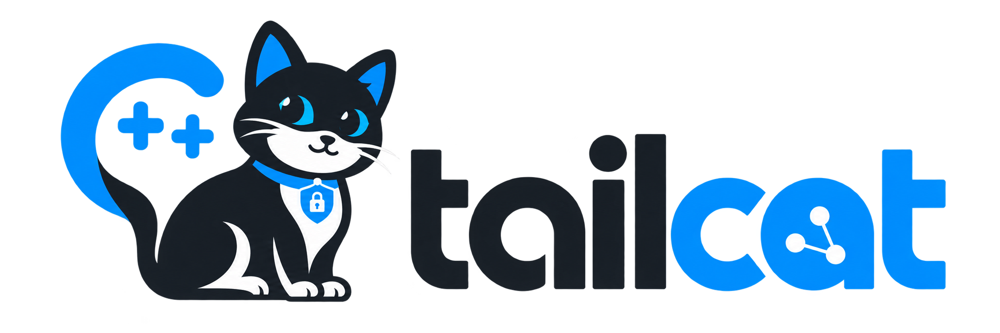

<p align="center">
  
</p>

# Tailcat in C++

This repository is a native C++20 rewrite of [tailscale/tailcat](https://github.com/tailscale/tailcat).
The goal is to preserve Tailcat's user-facing model while removing the Go toolchain and Go source code entirely.

## Rewrite status

The repository has been converted to a C++20/CMake project and builds are defined for Linux, macOS, and Windows.
The original Go implementation and Go-specific build/release tooling have been removed from the rewrite branch.

**Important:** the native data plane is still being implemented. Upstream Tailcat depends deeply on Tailscale's Go-only userspace WireGuard, magicsock/DERP, and userspace TCP/IP stack. This branch deliberately does not hide that dependency behind a Go shared library or subprocess. Commands that need the data plane currently return a clear `not yet enabled` error rather than silently falling back to Go.

That means this branch is a clean C++ foundation, not yet a wire-compatible replacement for upstream Tailcat.

## Build

Requirements:

- CMake 3.24+
- Ninja
- A C++20 compiler
  - Linux: GCC or Clang
  - macOS: Apple Clang
  - Windows: MSVC or clang-cl

### Linux

```sh
cmake --preset linux
cmake --build --preset linux
ctest --preset linux
```

### macOS

```sh
cmake --preset macos
cmake --build --preset macos
ctest --preset macos
```

### Windows

From a Developer PowerShell:

```powershell
cmake --preset windows
cmake --build --preset windows
ctest --preset windows
```

The resulting executable is under `build/<platform>/tailcat` (`tailcat.exe` on Windows).

## Current CLI surface

The C++ command parser recognizes the upstream command families so they can be implemented incrementally without changing the public shape again:

```text
tailcat
tailcat <tc-address> [port]
tailcat serve ...
tailcat forward ...
tailcat browse ...
tailcat cp ...
tailcat recv ...
tailcat ssh ...
tailcat socks ...
tailcat ping ...
tailcat genkey ...
tailcat parse ...
```

`--help`, `--version`, and platform initialization are implemented. Data-plane commands remain disabled until the native transport lands.

## Porting plan

The remaining compatibility work is intentionally split into independent layers:

1. Tailcat address encoding/decoding and CBOR wire types.
2. Native Curve25519/WireGuard key handling.
3. DERP-over-HTTPS client and framing.
4. Discovery messages and endpoint exchange.
5. Userspace WireGuard packet transport.
6. Userspace TCP/UDP stack and stream multiplexing.
7. CLI parity: pipe, serve, forward, browse, ping, SOCKS, SSH, files, recv, and cp.
8. Interop tests against an upstream Go Tailcat binary until the Go reference can be removed from CI fixtures as well.

The acceptance criterion for the rewrite is interoperability with upstream Tailcat addresses and peers without linking, embedding, generating, or executing Go code in the shipped implementation.

## CI

GitHub Actions builds and runs CTest on:

- Ubuntu
- macOS
- Windows

See `.github/workflows/build.yml`.

## License

BSD-3-Clause, matching upstream. See [LICENSE](LICENSE).

## Upstream

Original project: https://github.com/tailscale/tailcat
